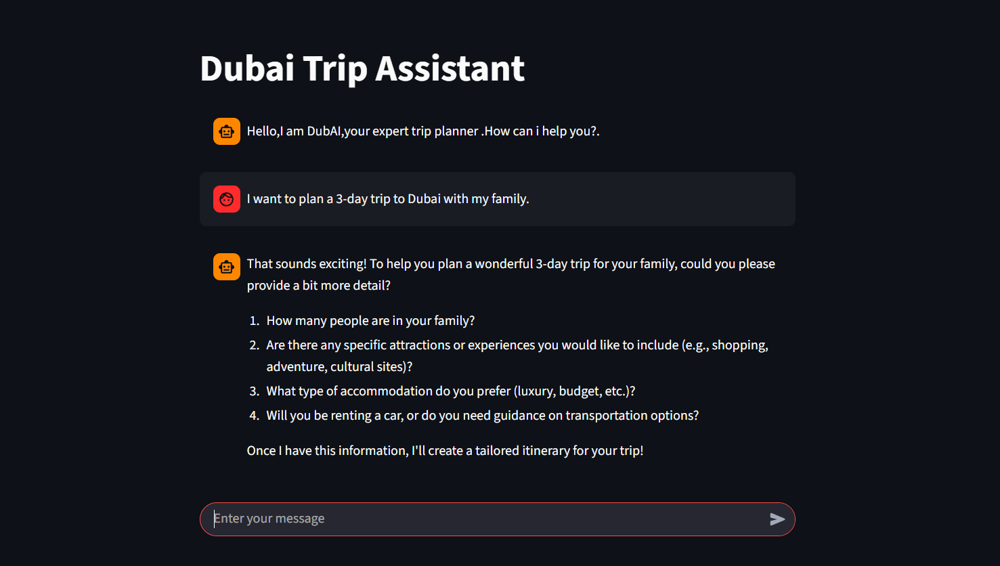

# Dubai Trip Assistant

**Dubai Trip Assistant** is an interactive chatbot application built using **Streamlit** and **OpenAI GPT-4o-mini**. The assistant, named **DubAI (D.AI)**, helps users plan their Dubai trips by providing expert guidance on attractions, hotels, food, events, and creating day-wise itineraries.

## Features

- Interactive chat interface using Streamlit
- Expert recommendations for Dubai tourism locations, restaurants, and events
- Personalized trip planning based on user preferences
- Day-wise itinerary generation
- Professional and concise responses (under 200 words)

## Technologies Used

- Python
- Streamlit
- OpenAI API (GPT-4o-mini)
- dotenv (for environment variable management)

